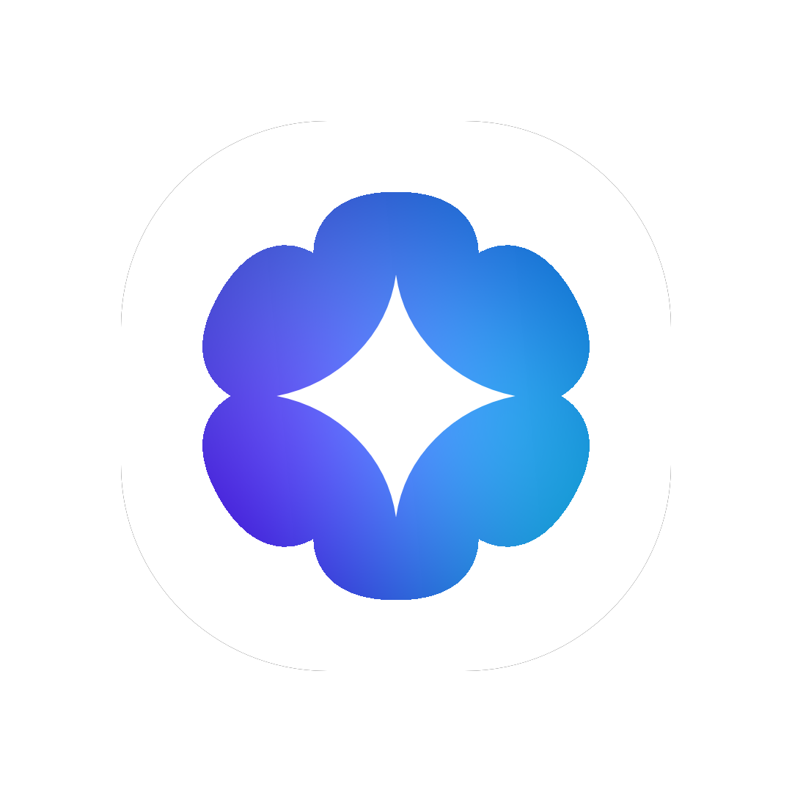

<table align="center">
  <tr>
    <td align="center">
      
    </td>
    <td align="left">
      <h2><strong>Coditan - Your AI Coding buddy!</strong></h2>
      <h3><strong><a href="https://coditan.com/downloads">The Coditan beta is out!</a></strong></h3>
      <p>
        We are happy to announce the release of Coditan's first public beta!</br>
        If you're interested in Coditan and want to try its beta you can <strong><a href="https://coditan.com/downloads">download the beta by clicking this link</a></strong></br>
        Additionally if you encounter bugs please report using <strong><a href="https://github.com/EithanAsulin/Coditan/issues">GitHub Issues (bug report)</a></strong></br>
      </p>
    </td>
  </tr>
</table>

<p align="center">
  
  
  
</p>

<h3>
<p align="center">
  <strong>
  <a href="./assets/READMEs/Contributors.md">|  Contributors  | </a>
  <a href="https://coditan.com/downloads"> Downloads  |</a>
  <a href="https://coditan.com">  Website  | </a>
  <a href="https://coditan.com/languages">  Languages  | </a>
  <a href="https://coditan.com/contacts"> Contacts  | </a>
  <a href="./assets/READMEs/Roadmap.md"> Roadmap  | </a>
  <a href="https://coditan.com/skills"> Skills  |</a>
  </strong>
</p>
</h3>


<h1 align="center"><strong>About Coditan</strong></h1>

**Coditan is an AI-powered coding buddy built to solve the biggest problem with modern coding agents.**

Most AI coding agents place users behind strict usage limits, expensive subscriptions, and restricted access to models.

The core issue is cost. Frontier models are expensive to run, and providers pass those costs onto users through pricing and usage caps. In practice, users often do not fully utilize what they are paying for, yet they still face limits.

Coditan takes a different approach. Instead of bundling a model, it lets users bring their own. Whether cloud-based or locally hosted, you connect the model and Coditan provides the tooling layer that turns it into a capable coding buddy.

**So a common thought is:** "I would rather pay for a tool with limits than deal with setup, configuration, and managing AI keys."

That is where most coding agents fall short. They assume users are willing to manage model access, keys, and setup workflows before getting value from the tool.

Coditan is different. It lets you code without setup friction or running into limits mid-workflow.

> [!Note] 
> ### Coditan includes built-in tutorials covering: 
> - **[Creating an AI API key](https://coditan.com/guides/api-guide)**
> - **[Running a local AI model](https://coditan.com/guides/local-guide)**

<h1 align="center"><strong>Quick start</strong></h1>

> [!Tip]
> **You can follow this quick start guide in a more interactive way in [the Coditan website](https://coditan.com/quickstart)**

When downloading **[Coditan](https://coditan.com/downloads)** it might be difficult to setup for the first time, this is why this **Guide** exists,

To begin you will need to enter **[The Coditan Downloads](https://coditan.com/downloads),** Once you're there you'll need to select the **correct installer for your system**

### MacOS (MacBooks & Macs) 
- **[Download for M-Series MacOS (ARM)](https://coditan.com/downloads/macos/arm)**
- **[Download for intel MacOS (Pre-2020 / x86)](https://coditan.com/downloads/macos/intel)**

### Windows
> [!Note]
> Only x86 PCs, Snapdragon processors are not supported due to lack of hardware
- **[Download for Windows (x86 Only)](https://coditan.com/downloads/windows/)**

### Linux
- **[Download for debian-based distros (Ubuntu, Linux mint, Debian & etc)](https://coditan.com/downloads/linux)**

---
After you've installed the **correct installer** Install you will need to **Double click the installer** after that you will be greeted by a menu based on your operating system

### MacOS
- In **MacOS** You'll be greeted with a **standard MacOS installer,** simply drag & drop Coditan right into your Application folders and wait for it to finish copying.

### Windows
- In **Windows** You'll be greeted with a **standard Windows installer**, You simply click Continue, agree to the license and wait for it to finish installing!

### Linux

- In **Linux (Ubuntu & Linux mint)** You'll be greeted with a simple "Install this package?", Just click install and enter your password!
- In **Debian** or other distros that **Don't have an easy installer you'll need to run this command :
```bash
cd ~/Downloads/ && echo "[*] Now you'll need to enter your sudo password to install the package.
sudo apt install ./Coditan_Beta_1_Linux.deb 
echo "[*] Coditan should've been installed normally, if you encounter any issues please report in https://github.com/EithanAsulin/Coditan/issues"
```
---

Now that you've installed Coditan you should see it in your apps by simply searching ```Coditan```, And the ```Coditan (Beta)``` should appear!

Once you've opened **Coditan** You'll be greeted by a simple setup

- **Language**
Select Your Language of choice (Scroll with mouse or trackpad)

- **Select your theme**
Pick from either Light mode (default) or Dark mode

- **Sign-up/Login**
It's recommended to login with **Google or GitHub** for the most stable and easy experience, 
You simply click on the "Continue with..." and it'll open your web browser from there simply just choose an account and you'll be redirected back to Coditan

> [!Warning]
> We are aware of a **Javascript bug** currently happening in some cases, we don't know the exact cause and haven't managed to replicate it more than twice,
> If you encounter this bug please send it to us with **[GitHub Issues (Bug Report)](https://github.com/EithanAsulin/Coditan/issues)**.

- **Adding your API key**
> [!Note]
> If you're using local models you can leave it empty and click continue

> [!Tip]
> If It's your first time making an API Key,
> It's recommended to follow our official guide
> It includes how you can get your first API key and what free models you can easily use!
> **[You can find it by clicking this text](https://coditan.com/api-guide)**

Once in this menu simply just paste your API key in the input box and click continue
**(Your API key stays fully private and only stored locally)**

- **Selecting a model**
Once you've gotten to this menu you can finally pick an AI to start your adventure with!
You can pick from our recommended options or use a custom model from your choosen API or a local one.

> [!Tip]
> When selecting a model it's easy to get confused but Here's our recommendations
> 
> 1. Google Gemini models - Gemini models may be weaker in coding but they offer the biggest tier for a frontier model, We recommend these models :
> - **gemini/gemini-3.5-flash-preview**
> - **gemini/gemini-3.1-preview**
>
> 2. Ollama cloud - Ollama cloud may not offer the best models but they have the biggest free usage known to use, Ollama cloud models were used while testing Coditan itself and we personally have never ran into any limits, We recommend these models :
> - **ollama/gpt-oss:120b-cloud**
> - **ollama/qwen3-coder-next:cloud**
>
> 3. Mistral AI - Mistral offers free access to their frontier models with near unlimited usage with their **[Experiment plan](https://help.mistral.ai/en/articles/455206-how-can-i-try-the-api-for-free-with-the-experiment-plan)** they offer top-tier coding models designed for agentic coding, We recommend these models: 
> - **mistral/mistral-medium-3.5**
> - **mistral/devstral-latest**

Now that you've fully set up Coditan you can try our **Recommended beginner projects** to learn how to use Coditan for your workflow

| **Project** | **What You Learn** | **Recommended Prompt** |
|:--------|----------------| ------------------ |
| Simple Tic Tac Toe game | With this you can learn about how to give Coditan prompts, how to use the built in artifacts to test in Coditan itself and you learn how to use Coditan's interface | Make a 2 Player Tic Tac Toe game using HTML, i want a turn based system with a premium interface and responsive UI on PC & mobile. Make an artifact of it when you're done. |
| Simple system resources Display | You learn how Coditan can use its built it ```get_os``` to make an App designed for your operating system | Make a Python + HTML app that displays the resource usage for my PC Parts (CPU, GPU, RAM, Temps) i want it to display in a slick moderm premium interface with constantly updating graphs to show accurate system usage |
| Roll the dice game | Learn how Coditan can make, test and fix Apps all on its own with minimal interaction | Make a roll the dice game using Python, i Want a premium UI and a 3d dice With the option to change from 4, 6, 8, 10, 12, 20. Once done please launch the app for me to test. |

<h1 align="center"><strong>Why Coditan</strong></h1>

**So why should you choose Coditan over other tools?**
When looking at Agentic coding tools you easily notice a pattern :

<h2 align="center"> Paid Tools</h2>

<div align="center">

| **Pros** | **Cons** | 
|:-------|-------:|
| Reliable | Expensive |
| Frontier AI | Limited Usage |
| Best tools | Locked to vendor model |

</div>

<h2 align="center"> Free Tools</h2>

<div align="center">

| **Pros** | **Cons** | 
|:---------|---------:|
| Free to use | Lower quality |
| Unlimited usage | Less features |
| Accessible for more | Harder to setup |
| Use any AI | Less free options or local (Worse quality in most cases) |

</div>

**So where does Coditan fix that?**
Coditan solves it by combining the best of both worlds, Coditan offers :
- **Use any model**
- **Premium interface**
- **Unlimited Usage**
- **No limits to free users**
- **Easier setup with dedicated guides**
- **Local or cloud AI**
- **Reliable software**

Meaning you will finally be able to Enjoy the best of both world without Having to compromise On Anything!

<h1 align="center"><strong>Features</strong></h1>

<p align="center">Coditan includes many features but it could easily get hard to keep up with all of them, so heres a simple table grid helping you learn skills and what they do!</p>

<div align="center">

| **Feature**. | **Explanation** |
|:----------------|--------------|
| File management | Allows Coditan and any AI you connect to it to **Create, Read, Edit, Move, Copy, Delete & manage** your files (which includes folders too) |
| Terminal actions | Allows Coditan to run native system commands (Doesn't include sudo commands), Each terminal runs as a sub-process allowing you to have a seamless experience |
| Automations | Allows you to set Automations to trigger at a specific time, You can set what it does, what AI does it and even where it does it. |
| Projects | Allows you to make projects where you work in one directory with a folder like experience allowing you to expand and minimize chats |
| Appearance | Allows you to change how Coditan looks with changing between light and dark mode with more customization coming soon |
| Working directory | Set a base directory that Coditan has access to in default chats |
| Smart API | Automatically change your AI if your Other AI hits a usage limit or fail, this allows you to keep working without having to stop in the middle |
| Artifacts | Artifacts allow you to view HTML files in real time, you can test them and find issues directly within Coditan eliminating the need to swap windows | 
| Context Compactor (Standard) | The context compactor (Standard) compacts the conversation by removing past actions that were done eliminating hundreds of potential lines |
| Context Compactor (AI-Powered) | The context compactor powered by AI is a combo of the standard and the Use of your current AI to summarize responses |
| File Tree | File tree gives your AI a full tree, think of it like a map that says exactly where files are |


</div>


<h1 align="center"><strong>Open source</strong></h1>

For all our open source enthusiasts, **Every Piece Code in this repository (Custom actions and potentially more in the future) is Open source!**
You can explore community & official skills/actions right within this repository you can use it for...
- **Learning new things** 
- **Building your own projects**
- **Creating new skills and tools**

We believe in sharing work with the community and letting it be useful beyond just one place.

---

### One simple rule

Code from this repository must not be used to train AI models.
and This applies to everyone,
We respect the work that goes into building software & code, and we want it used in ways that don’t take away from the people who created it!

> [!Note]
> If you were wondering,
> Yes, This rule applies for us too!
> We promise to not use this code in...
> - **Train data**
> - **Selling nor commercial redistribution**
> Sadly we can't legally protect this,
> We hope everyone mutually accepts this one simple rule.

> [!Note]
> Additionally you should know none of Coditan's source code is open source Currently!
> But we will likely **release Open source** things like **Coditan's models (Fine tuned), Interface components, Actions or useful snippets from the Coditan App.**
